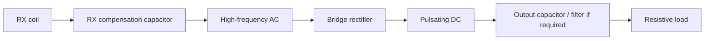

# Receiver Power Path

```mermaid
flowchart LR
    RX["RX coil"] --> C["RX compensation capacitor"]
    C --> AC["High-frequency AC"]
    AC --> BR["Bridge rectifier"]
    BR --> DC["Pulsating DC"]
    DC --> CAP["Output capacitor / filter if required"]
    CAP --> LOAD["Resistive load"]
```

The rectifier and filter must be selected after secondary voltage/current waveforms, output voltage, load power and ripple requirements are known.
