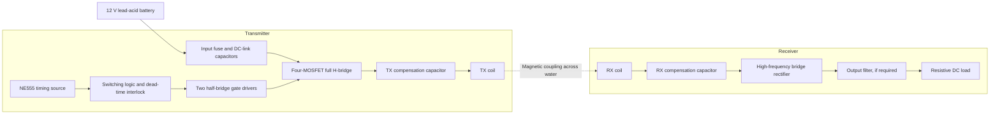

# System Power Path

```mermaid
flowchart LR
    BAT["12 V lead-acid battery"] --> FUSE["Input fuse and DC-link capacitors"]
    subgraph TX["Transmitter"]
        TIMER["NE555 timing source"] --> LOGIC["Switching logic and dead-time interlock"]
        LOGIC --> DRV["Two half-bridge gate drivers"]
        FUSE --> BRIDGE["Four-MOSFET full H-bridge"]
        DRV --> BRIDGE
        BRIDGE --> CTX["TX compensation capacitor"]
        CTX --> LTX["TX coil"]
    end
    LTX -. "Magnetic coupling across water" .-> LRX["RX coil"]
    subgraph RX["Receiver"]
        LRX --> CRX["RX compensation capacitor"]
        CRX --> RECT["High-frequency bridge rectifier"]
        RECT --> FILTER["Output filter, if required"]
        FILTER --> LOAD["Resistive DC load"]
    end
```

The bridge switching waveform is bipolar. The coil current waveform depends on the resonant network and load; it should not be assumed to be a square wave.
